# TerraformとLocalStackを用いたAWS環境（S3, Lambda, Amplify）のIaCプロビジョニング
TerraformとLocalStackを使用してawsをコードで管理し自動作成

## 概要
このプロジェクトは、**Infrastructure as Code (IaC)** の原則に基づき、**Terraform** と **LocalStack** を活用してAWS環境のプロビジョニングを自動化します。特に、S3バケット、Lambda関数、Amplifyアプリケーションといった主要なAWSリソースの定義とデプロイをコードで管理することで、開発・検証プロセスの効率化と一貫性の確保を目指します。

LocalStackを用いることで、ローカル環境でAWSサービスをエミュレートし、本番環境へのデプロイ前に安全かつ迅速なテストを行うことが可能です。

## 使用技術
- Terraform
- Terraform Cloud
- AWS各サービス / AWS CLI
- LocalStack
- Docker
- github / github CLI

## 準備
- github access token
- awsアカウント（OIDC）
- Lambda関数のZIPファイル
- フロントエンドビルド成果物
- Amplify用のGitHubリポジトリ
- terraform cloudプロジェクト（dev, prod）
- cloudでの変数設定
- SSMパラメータ
- CORS用ドメイン名の更新
- ECR用のDockerイメージ
- sslが必要な場合はssl証明書

## 構成
```text
/
├── .devcontainer/
│   ├── devcontainer.json
│   └── setup.sh
├── bootstrap/
│   ├── main.tf   # OIDCプロバイダー・認証、IAMロール・ポリシー設定
│   ├── variables.tf
│   └── outputs.tf
├── terraform/
│   ├── environments/ # 環境ごとのプロバイダー
│   │   ├── local/      
│   │   │   ├── provider.tf      
│   │   │   ├── main.tf # モジュール呼び出し(terraform/main.tf)
│   │   │   └── variables.tf  
│   │   ├── dev/      
│   │   │   ├── provider.tf      
│   │   │   ├── main.tf
│   │   │   └── variables.tf  
│   │   └── prod/      
│   │       ├── provider.tf      
│   │       ├── main.tf
│   │       └── variables.tf  
│   ├── modules/
│   │   ├── s3/                 # S3モジュールのディレクトリ
│   │   │   ├── main.tf         # S3モジュールのリソース定義 (s3バケットなど)
│   │   │   ├── variables.tf    # S3モジュール固有の変数定義
│   │   │   ├── outputs.tf      # S3モジュール固有の出力定義
│   │   │   └── bucket_policy.tf  
│   │   ├── cloudfront/         # cloudfrontモジュールのディレクトリ
│   │   │   ├── main.tf         # ディストリビューション、キャッシュ、アクセスコントロールなどの定義
│   │   │   ├── variables.tf    
│   │   │   └── outputs.tf      
│   │   ├── lambda/
│   │   │   ├── main.tf         # Lambda関数、IAMロール、ポリシー
│   │   │   ├── variables.tf
│   │   │   └── outputs.tf
│   │   ├── s3-lambda-integration/ # S3とLambdaの連携モジュールのディレクトリ
│   │   │   ├── main.tf         # S3通知設定、Lambda権限
│   │   │   ├── variables.tf
│   │   │   └── outputs.tf
│   │   ├── amplify/            # Amplifyモジュールのディレクトリ
│   │   │   ├── main.tf         # Amplifyアプリケーション、ブランチなどの定義
│   │   │   ├── variables.tf
│   │   │   └── outputs.tf
│   │   ├── ecr/                # コンテナイメージのリポジトリ
│   │   │   ├── main.tf         # ECRリポジトリとライフサイクルポリシーなど
│   │   │   ├── variables.tf
│   │   │   └── outputs.tf
│   │   ├── ecs-cluster/        # ECS クラスター定義 (EC2/Fargate 両対応)
│   │   │   ├── main.tf         # クラスター、CloudWatchログ設定など
│   │   │   ├── variables.tf
│   │   │   └── outputs.tf
│   │   ├── ecs-service-fargate/  # Fargateサービス専用
│   │   │   ├── main.tf         # Fargateタスク定義、サービス、ALBターゲット登録等
│   │   │   ├── variables.tf
│   │   │   └── outputs.tf
│   │   ├── network/            # VPC・ネットワーク関連一式（サブネット, SG等含む）
│   │   │   ├── main.tf         # VPC, IGW, Subnet, Route Table, Security Groupなどの構成
│   │   │   ├── variables.tf
│   │   │   ├── security_group.tf # セキュリティグループとルールの管理
│   │   │   └── outputs.tf
│   │   ├── rds/                # RDSデータベースモジュール
│   │   │   ├── main.tf         # RDSインスタンス、パラメータグループ、セキュリティグループ定義
│   │   │   ├── variables.tf
│   │   │   └── outputs.tf
│   │   ├── aurora/             # Auroraデータベースモジュール
│   │   │   ├── main.tf         # Auroraクラスター、インスタンス、パラメータグループ、セキュリティグループ定義
│   │   │   ├── variables.tf
│   │   │   └── outputs.tf
│   │   └── alb/                # ALBモジュール
│   │       ├── main.tf         # ALB本体、ターゲットグループ、HTTP/HTTPSリスナー、パスベースルーティングルール定義
│   │       ├── variables.tf
│   │       └── outputs.tf
│   ├── main.tf                 # ルートモジュールのmain.tf (modules/ を呼び出す)
│   ├── variables.tf            # ルートモジュールの変数定義
│   ├── outputs.tf              # ルートモジュールの出力定義
│   ├── locals.tf               # 共通・基本設定
│   ├── locals-storage.tf       # S3・ストレージ関連
│   ├── locals-database.tf      # RDS・Aurora関連
│   └── locals-compute.tf       # ECS・Lambda・ALB関連
├── README.md
├── Makefile
└── .gitignore

```

## セグメント分離構成
```text

terraform/
├── segments/
│   ├── foundation/              # 基盤セグメント
│   │   ├── environments/
│   │   │   ├── local/
│   │   │   │   ├── provider.tf
│   │   │   │   ├── main.tf      # ../..をモジュール呼び出し
│   │   │   │   ├── variables.tf
│   │   │   │   └── outputs.tf
│   │   │   ├── dev/
│   │   │   └── prod/
│   │   ├── main.tf              # 基盤リソースのみ
│   │   ├── variables.tf
│   │   ├── outputs.tf           # 他セグメント向けのアウトプット
│   │   ├── locals-network.tf    # ネットワーク設定
│   │   └── locals-database.tf   # データベース設定
│   ├── application/             # アプリケーションセグメント  
│   │   ├── environments/
│   │   ├── main.tf              # アプリケーションリソース
│   │   ├── variables.tf
│   │   ├── outputs.tf
│   │   ├── remote_state.tf      # foundationからの取得
│   │   ├── locals-storage.tf    # S3, CloudFront設定
│   │   └── locals-compute.tf    # ECS, ALB設定
│   └── data-processing/         # データ処理セグメント
│       ├── environments/
│       ├── main.tf              # Lambda, S3統合など
│       ├── variables.tf
│       ├── outputs.tf
│       └── remote_state.tf      # foundationからの取得
└── modules/                     # 既存モジュール
```

## 設計によるコードの一元管理とヒューマンエラーの削減
本プロジェクトでは、各環境ディレクトリで必要なモジュールを直接呼び出す代わりに、共通のルートTerraform構成 (terraform/ ディレクトリ) をモジュールとして呼び出し、その中でリソースの作成を制御する設計を採用しています。このアプローチは、以下の課題を解決するために選択されました。

**コードの重複とメンテナンスコストの増大**:   
もし各環境ディレクトリ（environments/local、environments/dev、environments/prod）のmain.tfで個別にS3バケットやLambda関数などのモジュールを呼び出す場合、多くのコードが重複します。例えば、ある共通モジュールの入力変数を追加したり、その設定を変更したりするたびに、すべての環境のmain.tfを手動で修正する必要が生じます。これは大規模なプロジェクトになるほど、非常に手間がかかり、非効率的です。

**環境間の一貫性欠如とヒューマンエラーのリスク**:   
手動での複数ファイルの修正は、環境間での設定の不一致を引き起こしやすくなります。特定の環境で修正が漏れたり、誤った設定をしてしまったりするリスクが高まり、インフラの信頼性を損なう原因となります。また、プルリクエストのレビューでも、共通の変更がすべての環境で正しく適用されているかを確認する作業が複雑化します。

### 現在の設計のメリット:

**コードの一元化**:   
ほとんどのリソースモジュールの呼び出しと設定がルートのterraform/main.tfに集約されています。これにより、共通のインフラ構成を変更する際の修正箇所が最小限に抑えられ、単一の場所で全体像を把握し、管理できます。

**ヒューマンエラーの削減**:   
共通部分の変更は一箇所に集中するため、環境間での設定の不一致や修正漏れといったヒューマンエラーのリスクが大幅に低減されます。

### トレードオフと考慮事項:

この設計には、ルートmain.tfがvar.environmentに基づくcountの条件分岐で複雑になる可能性があるというトレードオフが存在します。しかし、この「一箇所に集約された複雑さ」は、各環境にコードが散らばることによる「分散した複雑さ」よりも、デバッグや全体像の把握がしやすいと判断しています。try()関数などのTerraformの組み込み機能を利用して、条件付きのリソース参照も安全に行っています。

### リソース作成の流れ

リソースがどのようにプロビジョニングされるかの全体像は以下の通りです。

```mermaid
flowchart LR
    A["開発者"] --> B{"make local-xxxを実行"}
    B --> C["terraform/environments/localが実行される"]
    C --> D["terraform/main.tfが呼び出される"]
    D --> E["locals-*.tfを読み込み"]
    E --> F["各モジュールに設定値を渡す"]
    F --> G["各モジュールが実行される"]
    G --> H["リソース作成 (LocalStack/AWS)"]
    H --> I["完了"]
```



### システム概要図

```mermaid
graph TB
    subgraph "🔍 システム概要 - ユーザー視点"
        Users[👥 Users] --> CloudFront[CloudFront<br/>CDN]
        CloudFront --> Frontend[React App<br/>S3 Static Website]
        Users --> API[REST API<br/>via ALB]
        API --> Backend[Backend Service<br/>ECS Fargate]
        Backend --> Database[(Database<br/>RDS/Aurora)]
        
        Users --> Upload[File Upload]
        Upload --> Processing[Auto Processing<br/>Lambda]
    end
```


### ネットワーク構成図

```mermaid
graph TB
    subgraph "🌐 ネットワーク構成"
        subgraph VPC["VPC (10.0.0.0/16)"]
            subgraph PublicZone["パブリックゾーン"]
                PubSub1[Public Subnet 1<br/>10.0.1.0/24<br/>AZ-a]
                PubSub2[Public Subnet 2<br/>10.0.2.0/24<br/>AZ-b]
                ALB[Application<br/>Load Balancer]
                Fargate[ECS Fargate<br/>Tasks]
            end
            
            subgraph PrivateZone["プライベートゾーン"]
                PrivSub1[Private Subnet 1<br/>10.0.11.0/24<br/>AZ-a]
                PrivSub2[Private Subnet 2<br/>10.0.12.0/24<br/>AZ-b]
                RDS[(RDS Instance)]
                Aurora[(Aurora Cluster)]
            end
        end
        
        Internet[🌐 Internet] --> CloudFront[CloudFront<br/>CDN]
        CloudFront --> S3[S3 Static Website]
        Internet --> IGW[Internet Gateway]
        IGW --> PubSub1
        IGW --> PubSub2
        
        Internet -->|HTTP/HTTPS<br/>Port 80/443| ALB
        ALB -->|Port 8080| Fargate
        
        PubSub1 --> ALB
        PubSub2 --> ALB
        PubSub1 --> Fargate
        PubSub2 --> Fargate
        
        PrivSub1 --> RDS
        PrivSub2 --> Aurora
        
        Fargate -->|PostgreSQL<br/>Port 5432| RDS
        Fargate -->|MySQL<br/>Port 3306| Aurora
        Fargate -->|HTTPS/HTTP<br/>Port 443/80| Internet
    end
```


### セキュリティグループ構成図

```mermaid

graph TB
    subgraph "🔒 セキュリティグループ構成"
        subgraph Internet["🌐 インターネット"]
            Users[👥 Users<br/>0.0.0.0/0]
        end
        
        subgraph ALBSG["🛡️ ALB Security Group"]
            ALB[Application<br/>Load Balancer]
        end
        
        subgraph AppSG["🛡️ Application Security Group"]
            Fargate[ECS Fargate<br/>Backend Service]
        end
        
        subgraph DBSG["🛡️ Database Security Group"]
            RDS[(RDS<br/>PostgreSQL)]
            Aurora[(Aurora<br/>MySQL)]
        end
        
        subgraph VPCESG["🛡️ VPC Endpoint Security Group"]
            VPCE[VPC Endpoints<br/>S3, ECR, etc.]
        end
        
        subgraph External["🌐 外部サービス"]
            S3[S3 APIs]
            APIs[External APIs]
        end
        
        %% インバウンドルール
        Users -->|HTTP: 80<br/>HTTPS: 443| ALB
        ALB -->|App Port: 8080| Fargate
        Fargate -->|PostgreSQL: 5432| RDS
        Fargate -->|MySQL: 3306| Aurora
        Fargate -->|HTTPS: 443| VPCE
        
        %% アウトバウンドルール（インターネット）
        Fargate -->|HTTPS: 443<br/>HTTP: 80| S3
        Fargate -->|HTTPS: 443<br/>HTTP: 80| APIs
        
        %% 条件付きルール（開発環境のみ）
        subgraph DevOnly["🔧 開発環境のみ"]
            DevSSH[Developer<br/>SSH Access]
        end
        DevSSH -.->|SSH: 22<br/>特定CIDR| Fargate
    end
    
    %% スタイリング
    classDef sgBox fill:#e8f5e8,stroke:#2e7d32,stroke-width:2px
    classDef internet fill:#e3f2fd,stroke:#1976d2,stroke-width:2px
    classDef database fill:#fce4ec,stroke:#c2185b,stroke-width:2px
    classDef dev fill:#fff3e0,stroke:#f57c00,stroke-width:1px,stroke-dasharray: 5 5
    
    class ALBSG,AppSG,DBSG,VPCESG sgBox
    class Internet,External internet
    class RDS,Aurora database
    class DevOnly,DevSSH dev
```


## モジュール詳細

### ストレージ・コンピュートモジュール

**S3バケット (modules/s3)**
- **目的**: 静的ファイルホスティングとユーザーコンテンツの保存
- **主要リソース**:
  - フロントエンドアプリケーション用の静的ホスティングS3バケット（パブリックアクセス設定、ウェブサイト設定）
  - ユーザーコンテンツ保存用の複数バケット（プロフィール画像、文書、一時アップロードファイル）
  - バージョン管理、サーバーサイド暗号化（SSE-S3）、ライフサイクルルールの設定
  - CORS設定とパブリックアクセス制御

**Lambda関数 (modules/lambda)**
- **目的**: サーバーレス処理とイベントドリブン型の処理実行
- **主要リソース**:
  - Lambda関数本体（ZIP形式のデプロイパッケージ）
  - 実行用IAMロール（Lambda Basic Execution Role）
  - S3アクセス権限を持つカスタムIAMポリシー
  - CloudWatch Logsグループとログ保持期間設定
  - 環境変数とタイムアウト設定

**S3-Lambda統合 (modules/s3-lambda-integration)**
- **目的**: S3イベントトリガーによるLambda関数の自動実行
- **主要リソース**:
  - S3バケット通知設定（オブジェクト作成・削除イベント）
  - Lambda関数実行権限（S3サービスからの呼び出し許可）
  - イベントフィルタリング設定（プレフィックス、サフィックス）

**Amplifyアプリケーション (modules/amplify)**
- **目的**: フロントエンドアプリケーションの継続的デプロイとホスティング
- **主要リソース**:
  - Amplifyアプリケーション（GitHubリポジトリ連携）
  - ブランチ設定（main/developブランチ）
  - 自動ビルド・デプロイ設定
  - 環境変数とビルド設定
  - カスタムドメイン設定（オプション）

### コンテナ・オーケストレーションモジュール

**ECR (modules/ecr)**
- **目的**: Dockerイメージの保存と管理
- **主要リソース**:
  - ECRプライベートリポジトリ
  - ライフサイクルポリシー（古いイメージの自動削除）
  - イメージスキャン設定
  - レプリケーション設定（マルチリージョン対応）

**ECSクラスター (modules/ecs-cluster)**
- **目的**: コンテナオーケストレーションの基盤提供
- **主要リソース**:
  - ECSクラスター（EC2/Fargate両対応）
  - CloudWatchログ設定
  - キャパシティプロバイダー設定
  - クラスター設定（コンテナインサイト有効化）

**ECS Fargateサービス (modules/ecs-service-fargate)**
- **目的**: サーバーレスコンテナの実行とスケーリング
- **主要リソース**:
  - Fargateタスク定義（CPU、メモリ、コンテナ設定）
  - ECSサービス（デザイアドカウント、デプロイ設定）
  - タスク実行用IAMロール
  - ALBターゲットグループへの登録
  - Auto Scalingポリシー（CPU・メモリベース）
  - ヘルスチェック設定

### ネットワークモジュール

**ネットワーク (modules/network)**
- **目的**: セキュアで高可用性なネットワーク基盤の構築
- **主要リソース**:
  - VPC（Virtual Private Cloud）
  - インターネットゲートウェイ（IGW）
  - パブリック・プライベートサブネット（マルチAZ構成）
  - ルートテーブルと関連付け
  - NATゲートウェイ（プライベートサブネット用）
  - セキュリティグループ（Web、App、DB層別）
  - ネットワークACL設定

### データベースモジュール

**RDS (modules/rds)**
- **目的**: リレーショナルデータベースの管理とバックアップ
- **主要リソース**:
  - RDSインスタンス（MySQL、PostgreSQL対応）
  - DBサブネットグループ（プライベートサブネット配置）
  - パラメータグループ（データベース最適化設定）
  - オプショングループ
  - 自動バックアップ設定（ポイントインタイムリカバリ）
  - 暗号化設定（KMS）
  - マルチAZ配置（高可用性）
  - モニタリング設定

**Aurora (modules/aurora)**
- **目的**: クラウドネイティブな高性能データベースクラスター
- **主要リソース**:
  - Auroraクラスター（MySQL/PostgreSQL互換）
  - Auroraインスタンス（ライター・リーダー）
  - クラスターパラメータグループ
  - 自動スケーリング設定
  - バックアップ・スナップショット設定
  - 高可用性設定（マルチAZ）
  - エンドポイント設定（読み書き分離）

### ロードバランサーモジュール

**ALB (modules/alb)**
- **目的**: 高可用性なWebアプリケーションの負荷分散
- **主要リソース**:
  - Application Load Balancer本体
  - ターゲットグループ（インスタンス・IP・Lambda対応）
  - HTTPSリスナー（SSL/TLS終端）
  - HTTPリスナー（HTTPS自動リダイレクト）
  - パスベースルーティングルール
  - ヘルスチェック設定
  - SSL証明書設定（ACM連携）
  - WAF統合（オプション）
  - アクセスログ設定

### コンテンツ配信モジュール

**CloudFront (modules/cloudfront)**
- **目的**: コンテンツ配信を高速化・最適化し、S3やALBなどのオリジンへの負荷を軽減
- **主要リソース**:
  - CloudFrontディストリビューション (S3またはカスタムオリジン対応)
  - Origin Access Control (OAC) 設定（S3への直接アクセスを制限）
  - ビューアプロトコルポリシー（HTTPSへの強制リダイレクト）
  - デフォルトおよび追加のキャッシュビヘイビア
  - TTL（Time-to-Live）設定（キャッシュの有効期限）
  - SPA（シングルページアプリケーション）対応のカスタムエラーレスポンス（403/404エラーをindex.htmlにルーティング）
  - SSL証明書設定（ACM連携またはCloudFrontデフォルト）
  - WAF統合（オプション）
  - アクセスログ設定

## OIDC認証用のプロバイダー設定

このプロジェクトはterraform用リポジトリに存在し、アプリケーション用リポジトリは分離しています。
アプリケーション用リポジトリ内でのCI/CDワークフロー内でawsへ認証し、ECRにdockerイメージをpushすることになります。
その為、terraformでインフラ構築する場合、まずaws側にOIDC認証のIAMロールとポリシーを登録しておく必要があります。
bootstrap/ディレクトリを作成し、プロバイダー設定を行います。

```terraform
data "tls_certificate" "github_actions_deploy" {
  url = "https://token.actions.githubusercontent.com/.well-known/openid-configuration"
  #url = "https://token.actions.githubusercontent.com"
}

resource "aws_iam_openid_connect_provider" "github_actions_deploy" {
  url             = "https://token.actions.githubusercontent.com"
  client_id_list  = ["sts.amazonaws.com"]
  thumbprint_list = [data.tls_certificate.github_actions_deploy.certificates[0].sha1_fingerprint]
}
```

### GitHub Actions 用 OIDC 認証ロールの作成

Terraform でOIDCプロバイダーをAWSに登録した後、GitHub ActionsからAWSに認証するためのIAMロールを作成します。
以下の例では、特定のリポジトリ・ブランチからのみAssumeRoleを許可し、ECRへDockerイメージをPushするためのポリシーをアタッチしています。
セキュリティ上、ブランチ条件は必ず設定することを推奨します。

```terraform
// GitHub Actions用 IAMロール作成
resource "aws_iam_role" "github_actions_deploy_role" {
  name = "github-actions-deploy-role"

  assume_role_policy = jsonencode({
    Version = "2012-10-17",
    Statement = [
      {
        Effect = "Allow",
        Principal = {
          Federated = aws_iam_openid_connect_provider.github_actions_deploy.arn
        },
        Action = "sts:AssumeRoleWithWebIdentity",
        Condition = {
          StringEquals = {
            # GitHub Actions のリポジトリとブランチを制限
            "token.actions.githubusercontent.com:sub" = "repo:your-org/your-repo:ref:refs/heads/main"
          }
        }
      }
    ]
  })
}

// 必要なポリシーをアタッチ（ECR Push用）
resource "aws_iam_role_policy" "github_actions_ecr_policy" {
  name = "github-actions-ecr-policy"
  role = aws_iam_role.github_actions_deploy_role.id

  policy = jsonencode({
    Version = "2012-10-17",
    Statement = [
      {
        Effect   = "Allow",
        Action   = [
          "ecr:GetAuthorizationToken",
          "ecr:BatchCheckLayerAvailability",
          "ecr:CompleteLayerUpload",
          "ecr:InitiateLayerUpload",
          "ecr:PutImage",
          "ecr:UploadLayerPart"
        ],
        Resource = "*"
      }
    ]
  })
}

```

## 環境ごとのプロバイダー設定とリソース作成の制御

このプロジェクトでは、開発環境（LocalStack）と本番環境で異なるプロバイダー設定とリソースセットを使用するため、**Terraform実行コンテキストを環境ごとに分離する**設計を採用しています。

各環境ディレクトリ（`environments/local`、`environments/dev`、`environments/prod`）は、それぞれが独立したTerraformの実行ポイントとなります。これらのディレクトリ内には、その環境固有のプロバイダー設定と、共通の**ルートTerraform構成 (`../..` に位置する `terraform/` ディレクトリ全体)** をモジュールとして呼び出す設定が含まれています。

**LocalStack 環境でのプロバイダー設定:**
- `terraform/environments/local` ディレクトリでTerraformを実行した場合、`terraform/environments/local/providers.tf`内で定義されている`endpoints`ブロックが有効になり、AWSの各サービスは`http://localhost:4566` (LocalStack) を参照するようになります。   

- LocalStackでS3を使用する場合、`s3_use_path_style = true` の設定が必要です。これは、S3のURLスタイルを以下のように変更します：

- **Virtual hosted-style** (AWS標準): `https://bucket-name.s3.amazonaws.com/key`
- **Path-style** (LocalStack用): `https://s3.amazonaws.com/bucket-name/key`

例：
```terraform
endpoints {
    s3_use_path_style = true # LocalStack S3の推奨設定
    content {
      s3       = "http://localhost:4566"
```

### workspaceを使用してリソース作成を除外する場合
Terraformの**ワークスペース (`terraform workspace`)** 機能を利用して、開発環境 (LocalStack) と本番環境で同じTerraformコードを使用することもできます。   
terraform workspace new localでlocalワークスペースを作成し、LocalStackでサポートされていないリソースの作成自体を制御しています。

例：
```
count = terraform.workspace == "local" ? 0 : 1
```

**注意**:
terraform workspaceはディレクトリ単位で設定します。   
environments内の環境ごとで分けている場合、ルートではなくlocal内でterraform workspace new localをしなければ環境が切り替わりませんので注意しましょう。

### workspaceを使用しない場合
workspaceなどで分岐しない場合、個別にenvironment変数などで条件分岐をする必要があります。   
その際、親側でリソースを作成するかどうかを確定させる必要があります。

```terraform
// 以下のように、変数の値自体が真偽値である場合、
// その条件が示す環境が不明瞭になるため推奨されません。
// count = var.some_boolean_flag ? 1 : 0

count = var.environment == "local" ? 1 : 0 // これはOK
```

**注意**
countメタ引数を用いてリソースが条件付きで作成される場合、Terraformはそのリソースを常に配列として扱います。そのため、たとえ count=1でリソースが作成されても、その属性を参照する際には配列インデックス ([0]) を指定する必要があります。

また、count=0のためにリソースが作成されない場合、[0]インデックスでの直接参照はエラーになります。この問題を避けるためには、try(aws_resource_type.name[0].attribute, null) や length(aws_resource_type.name) > 0 ? aws_resource_type.name[0].attribute : null のような詳細な条件分岐が必要となり、Terraformコード全体が複雑化するため、特にルート構成で多数のリソースに適用される場合は、複雑さが増大する可能性があります。

# Terraform Remote State 設定ガイド

## LocalStackでローカルにS3バケットを作成

ローカル開発環境でTerraformのstateファイルを管理するために、LocalStackを使ってS3バケットを作成します。

```bash
awslocal s3 mb s3://[バケット名]
```

## remote_stateで別のtfstateのoutputを取得

### 設定方法

他のTerraformプロジェクトのstateファイルからoutputを参照するには、`terraform_remote_state`データソースを使用します。backendで指定したS3バケット名とキー名を正しく設定してください。

```terraform
data "terraform_remote_state" "application" {
  backend = "s3"
  config = {
    bucket = "your-terraform-state-bucket"
    key    = "application/terraform.tfstate"
    region = "ap-northeast-1"

    # LocalStack使用時の設定
    endpoints = {
      s3 = "http://localhost:4566"
    }

    access_key = "test"
    secret_key = "test"
    skip_credentials_validation = true
    skip_metadata_api_check = true
    use_path_style = true
    skip_requesting_account_id = true
  }
}
```

### outputの取得

データソースから他のプロジェクトのoutputを取得できます。

```terraform
subnets = data.terraform_remote_state.foundation.outputs.public_subnet_ids
```

## ステートファイルの確認

### ステートファイルをダウンロードして中身を見る

`awslocal s3 cp`コマンドを使って、ステートファイルをローカルにダウンロードできます。

```bash
awslocal s3 cp s3://your-terraform-state-bucket/[パス]/terraform.tfstate .
```

## 注意点

### outputsはトップレベルで行う

`terraform apply`コマンドを実行するディレクトリで`outputs`を設定しないと、stateファイルには出力されません。他のプロジェクトから参照したいリソースは、必ずトップレベルでoutputを定義してください。

## object_ownershipの分離
aws providerのバージョンアップによりAWS Provider v4.9.0以降はobject_ownershipが単独リソースとなっています。

```terraform
resource "aws_s3_bucket_ownership_controls" "example" {
  bucket = aws_s3_bucket.example.id
  rule {
    object_ownership = "BucketOwnerEnforced"
  }
}
```

## aws_s3_bucket_objectが非推奨へ
AWS Provider v4.0以降、aws_s3_bucket_objectが非推奨となりましたので、機能が同じaws_s3_objectを使用する。

```terraform
resource "aws_s3_object" "example" {
  key    = "example.txt"  # aws_s3_objectでは"key"は有効
  bucket = aws_s3_bucket.this.id
}
```

## depends_onで値を保証する
countまたはfor_eachの条件式が、plan実行時に確定できない値に依存している場合、Error: Invalid count argument:が発生します。   
depends_onを使用して値を保証すると解消されますが、使いすぎると複雑な依存関係となるので注意が必要です。

```terraform
depends_on = [aws_lambda_permission.allow_s3_to_invoke_lambda]
```

## S3静的ホスティングにおける環境変数とシークレット管理

AWS S3の静的ホスティングでは、環境変数やシークレットの設定機能がありません。
フロントエンドアプリケーションをS3で公開する場合、環境変数の値は以下の方法で設定できます：

1. **ビルド時埋め込み**: CI/CDパイプラインでビルド時に環境変数を直接埋め込む
2. **ランタイム取得**: アプリケーション起動時にAPI（Lambda/Edge等）から動的に取得する

### セキュリティ上の注意点

フロントエンドで機密情報を環境変数に設定することは推奨されません。もし現在そのような設計になっている場合は、以下の点を見直してください：

- **外部サービスのAPIキー**: 公開しても安全かを確認し、必要に応じてドメイン制限やスコープ制限を設定
- **データベースアクセス**: Supabaseのanon keyなど、公開前提のキーでもRLS（Row Level Security）等でセキュリティを確保
- **認証やサービスキーなどの機密情報**: サーバーサイドでのみ使用し、フロントエンドには含めない

### 推奨アプローチ

AWS公式では、S3単体でのホスティングよりもAmplifyでの統合ホスティングを推奨しています。   
AmplifyもS3をベースとした静的ホスティングサービスですが、CloudflareやNetlify、Vercelなどと同様の環境変数・シークレット管理機能を提供しています：

- **Amplify Gen2**: 統合された環境変数・シークレット管理機能
- **Amplify Gen1**: AWS Systems Manager Parameter Storeとの連携

これにより、セキュアな設定管理とシンプルなデプロイを両立できます。
S3からParameter Storeへのアクセス、CI環境からS3へのアクセス権などのIAM管理も煩雑になりません。

### S3でのSSR
S3は静的なファイル配信に特化しているため、Node.jsなどのサーバー実行環境を必要とするSSRには直接対応していません。

* **JAMStackやBFFなど、バックエンドと明確に分離された構成のSSR**:
    この場合は、S3で静的アセットをホストしつつ、SSRのロジックは別のサーバーレスサービス（Lambda@Edgeなど）で実行することで対応可能です。
* **Next.jsのApp Routerなど、サーバーサイドの実行環境を必要とする機能**:
    これらの機能を含むアプリケーションをS3で静的ホスティングすることはできません。これらの機能で機密情報を扱う場合は、VercelやNetlifyのような専用のサーバー環境、またはAWS Amplifyのような統合ホスティングサービスへの移行を検討する必要があります。

## Terraform CloudとLocalStackの接続エラー

**問題**: Terraform Cloudの実行環境から`localhost:4566`にアクセスできない。`connection refused`エラーがでます。

**解決方法**:
1. プロバイダーからcloudブロック削除/コメントアウト
2. `terraform init`（出来ない場合は`.terraform`削除してから再実行）
3. Terraform Cloud上の変数をターミナルに手動入力

```bash
# cloudブロック削除後
rm -rf .terraform
terraform init
export AWS_ACCESS_KEY_ID="test"
export AWS_SECRET_ACCESS_KEY="test"
```

## LocalStackでのサービス制限について

このプロジェクトではLocalStackを利用したローカル開発・テストをサポートしていますが、LocalStackの無料コミュニティ版では一部のAWSサービスが未サポートまたは機能が限定されているため、`terraform apply`時にエラーが発生する可能性があります。

**エラー例**:
```
Error: creating Amplify App: StatusCode: 501, api error InternalFailure: 
The API for service 'amplify' is either not included in your current license plan

Error: creating ECR Repository: operation error ECR: CreateRepository, https response error StatusCode: 501, RequestID: xxx, api error InternalFailure: The API for service 'ecr' is either not included in your current license plan or has not yet been emulated by LocalStack.

Error: creating ECS Cluster: operation error ECS: CreateCluster, https response error StatusCode: 501, RequestID: xxx, api error InternalFailure: The API for service 'ecs' is either not included in your current license plan or has not yet been emulated by LocalStack. 
```
