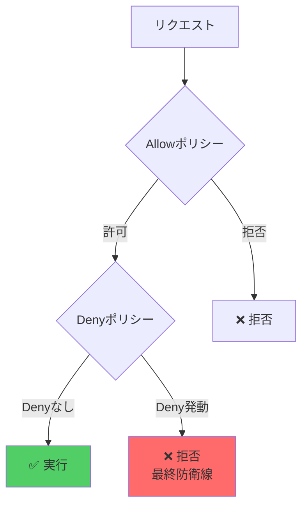
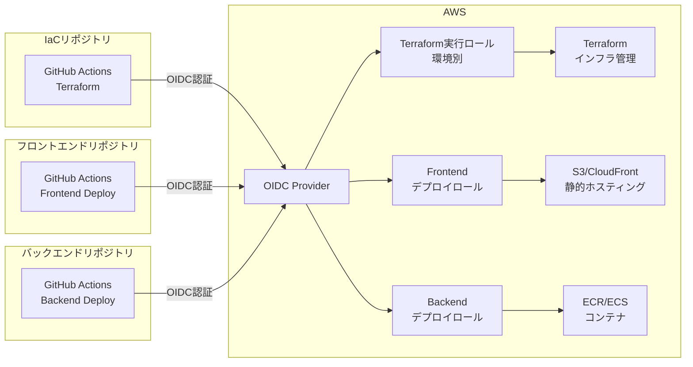

## セキュリティ設計

### 環境別IAMポリシー管理

このプロジェクトでは、**環境分離**と**最小権限の原則**に基づいたIAMポリシー設計を採用しています。

#### 設計原則

1. **環境別権限分離**
   - 開発環境（dev）: フル権限（柔軟な開発のため）
   - 本番環境（prod）: 制限付き権限（破壊的操作を除外）
   - Local環境: 開発環境と同等（LocalStackテスト用）

2. **多層防御（Defense in Depth）**
```
   レイヤー1: Allowポリシー（環境別に必要な権限を付与）
   レイヤー2: Denyポリシー（本番環境の破壊的操作を明示的に拒否）
```

3. **リソースレベルの制限**
   - Resource ARN: `${project_name}-${environment}-*` パターンでの制限
   - タグベース: CloudFront, Amplify, Route53, ACM等
   - パスベース: SSM Parameter Store

#### ポリシー構造
```
bootstrap/policies/
├── policy_terraform_execution.tf  # 環境別Allowポリシー統合
├── policy_prod_restrictions.tf    # 本番環境Denyポリシー
├── policy_frontend_deploy.tf      # フロントエンドCI/CD用
├── policy_backend_deploy.tf       # バックエンドCI/CD用
└── 個別サービスポリシー
    ├── policy_terraform_ec2.tf
    ├── policy_terraform_s3.tf
    ├── policy_terraform_iam.tf
    ├── policy_terraform_lambda.tf
    ├── policy_terraform_ecs_ecr.tf
    ├── policy_terraform_rds.tf
    ├── policy_terraform_alb.tf
    ├── policy_terraform_cloudfront.tf
    ├── policy_terraform_amplify.tf
    ├── policy_terraform_cloudwatch.tf
    ├── policy_terraform_ssm.tf
    ├── policy_terraform_route53.tf
    ├── policy_terraform_acm.tf
    └── policy_terraform_sts.tf
```

#### 環境別ポリシーの違い

| サービス | 開発環境 | 本番環境 | 保護方法 |
|---------|---------|---------|---------|
| **S3** | バケット削除可 | バケット削除不可 | Resource ARN + Deny |
| **Lambda** | 関数削除可 | 関数削除不可 | Resource ARN + Deny |
| **RDS** | DB削除可 | DB削除不可 | Resource ARN + Deny |
| **ECS/ECR** | クラスター削除可 | クラスター削除不可 | Resource ARN + Deny |
| **CloudFront** | ディストリビューション削除可 | 削除不可 | タグベース + Deny |
| **Route53** | ホストゾーン削除可 | 削除不可 | タグベース + Deny |

### 二重保護の仕組み

本番環境では、**Allowポリシーでの除外**と**Denyポリシーでの明示的拒否**の二重保護を実装しています。


**例: S3バケット削除**
```
1. 第1層: 本番環境のAllowポリシーに削除権限なし → ❌
2. 第2層: 万が一Allowに追加されても、Denyで拒否 → ❌
```

この設計により、ヒューマンエラーから本番環境を確実に保護します。

## OIDC認証とIAMロール設定

### アーキテクチャ概要

このプロジェクトでは、3種類のIAMロールを使い分けています：


### 1. OIDCプロバイダーの作成
```terraform
# bootstrap/main.tf
data "tls_certificate" "github_actions_deploy" {
  url = "https://token.actions.githubusercontent.com/.well-known/openid-configuration"
}

resource "aws_iam_openid_connect_provider" "github" {
  url             = "https://token.actions.githubusercontent.com"
  client_id_list  = ["sts.amazonaws.com"]
  thumbprint_list = [data.tls_certificate.github_actions_deploy.certificates[0].sha1_fingerprint]
}
```

### 2. 環境別Terraform実行ロール

各環境（dev, prod）ごとにロールを作成し、環境別のポリシーをアタッチします。
```terraform
# Terraform実行用ロール（環境別）
resource "aws_iam_role" "github_actions" {
  for_each = toset(var.environments)
  
  name = "${var.project_name}-GitHubActions-${each.value}"

  assume_role_policy = jsonencode({
    Version = "2012-10-17"
    Statement = [{
      Action = "sts:AssumeRoleWithWebIdentity"
      Effect = "Allow"
      Principal = {
        Federated = aws_iam_openid_connect_provider.github.arn
      }
      Condition = {
        StringEquals = {
          "token.actions.githubusercontent.com:aud" = "sts.amazonaws.com"
        }
        StringLike = {
          "token.actions.githubusercontent.com:sub" = [
            "repo:${var.github_repository}:ref:refs/heads/main",
            "repo:${var.github_repository}:ref:refs/heads/develop",
            "repo:${var.github_repository}:pull_request"
          ]
        }
      }
    }]
  })
}

# ポリシーアタッチメント
resource "aws_iam_role_policy_attachment" "terraform_execution" {
  for_each = toset(var.environments)
  
  policy_arn = aws_iam_policy.terraform_execution[each.value].arn
  role       = aws_iam_role.github_actions[each.value].name
}

# 本番環境のみDenyポリシーをアタッチ
resource "aws_iam_role_policy_attachment" "prod_restrictions" {
  count = contains(var.environments, "prod") ? 1 : 0
  
  policy_arn = aws_iam_policy.prod_restrictions[0].arn
  role       = aws_iam_role.github_actions["prod"].name
}
```

### 3. フロントエンド/バックエンドデプロイロール

アプリケーションリポジトリ用の専用ロールを作成します。
```terraform
# フロントエンドデプロイ用ロール
resource "aws_iam_role" "github_actions_frontend" {
  for_each = toset(var.environments)
  
  name = "${var.project_name}-GitHubActions-Frontend-${each.value}"
  # ... (S3/CloudFrontへのデプロイ権限)
}

# バックエンドデプロイ用ロール
resource "aws_iam_role" "github_actions_backend" {
  for_each = toset(var.environments)
  
  name = "${var.project_name}-GitHubActions-Backend-${each.value}"
  # ... (ECR/ECSへのデプロイ権限)
}
```

### セットアップ手順

1. **初回セットアップ**
```bash
   cd bootstrap/
   terraform init
   terraform plan
   terraform apply
```

2. **出力されたロールARNをGitHubシークレットに設定**
```
   # IaCリポジトリ
   AWS_ROLE_ARN_DEV=arn:aws:iam::123456789012:role/project-GitHubActions-dev
   AWS_ROLE_ARN_PROD=arn:aws:iam::123456789012:role/project-GitHubActions-prod
   
   # フロントエンドリポジトリ
   AWS_ROLE_ARN_DEV=arn:aws:iam::123456789012:role/project-GitHubActions-Frontend-dev
   AWS_ROLE_ARN_PROD=arn:aws:iam::123456789012:role/project-GitHubActions-Frontend-prod
   
   # バックエンドリポジトリ
   AWS_ROLE_ARN_DEV=arn:aws:iam::123456789012:role/project-GitHubActions-Backend-dev
   AWS_ROLE_ARN_PROD=arn:aws:iam::123456789012:role/project-GitHubActions-Backend-prod
```

### セキュリティのベストプラクティス

✅ **ブランチ制限**: 特定のブランチからのみロール使用を許可  
✅ **リポジトリ制限**: 特定のリポジトリからのみアクセス可能  
✅ **環境分離**: dev/prod で完全に分離されたロール  
✅ **責務分離**: Terraform/Frontend/Backend で専用ロール  
✅ **最小権限**: 各ロールは必要最小限の権限のみ

## 本番環境保護

### 保護されるリソース

`policy_prod_restrictions.tf` により、以下のリソースの破壊的操作が**完全に拒否**されます：

#### インフラストラクチャ
- ✅ **VPC/ネットワーク**: VPC、Subnet、IGW、NAT Gateway、Security Group削除
- ✅ **EC2**: インスタンス終了（タグベース制限）

#### ストレージ
- ✅ **S3**: バケット削除、オブジェクト削除
- ✅ **RDS/Aurora**: DBインスタンス削除、スナップショット削除、暗号化無効化

#### コンピュート
- ✅ **Lambda**: 関数削除、Layer削除
- ✅ **ECS/ECR**: クラスター削除、サービス削除、リポジトリ削除、イメージ削除

#### ネットワーク/配信
- ✅ **ALB**: ロードバランサー削除、ターゲットグループ削除
- ✅ **CloudFront**: ディストリビューション削除
- ✅ **Route53**: ホストゾーン削除、ヘルスチェック削除

#### アプリケーション
- ✅ **Amplify**: アプリ削除、ブランチ削除

#### セキュリティ/監視
- ✅ **IAM**: ロール削除、ポリシー削除、管理者権限エスカレーション防止
- ✅ **ACM**: 証明書削除、秘密鍵エクスポート
- ✅ **CloudWatch Logs**: ロググループ削除
- ✅ **SSM Parameter Store**: パラメータ削除

### 特殊な保護

#### NS/SOAレコードの保護（Route53）
```terraform
# すべての環境でNS/SOAレコードの変更を拒否
{
  Effect = "Deny"
  Action = ["route53:ChangeResourceRecordSets"]
  Condition = {
    StringEquals = {
      "route53:ChangeResourceRecordSetsRecordType": ["NS", "SOA"]
    }
  }
}
```

#### 権限エスカレーションの防止（IAM）
```terraform
# 管理者権限ポリシーのアタッチを拒否
{
  Effect = "Deny"
  Action = ["iam:AttachRolePolicy"]
  Condition = {
    ArnLike = {
      "iam:PolicyARN": [
        "arn:aws:iam::aws:policy/AdministratorAccess",
        "arn:aws:iam::aws:policy/PowerUserAccess"
      ]
    }
  }
}
```

### テスト方法

本番環境の保護が正しく機能しているかをテストする方法：
```bash
# 本番環境ロールでS3バケット削除を試行（失敗すべき）
aws s3 rb s3://myproject-prod-frontend --force
# Expected: Access Denied

# 開発環境ロールでS3バケット削除を試行（成功すべき）
aws s3 rb s3://myproject-dev-frontend --force
# Expected: Success
```

## 注意点

### IAMポリシーのサイズ制限

IAMポリシーには**6,144文字**の制限があります。サービスが増えてこの制限に達した場合：

1. **カテゴリ別に分割**
```
   terraform_compute  (EC2, Lambda, ECS)
   terraform_storage  (S3, RDS)
   terraform_network  (ALB, CloudFront, Route53)
```

2. **ポリシーサイズの監視**
```terraform
   output "policy_sizes" {
     value = {
       for env in var.environments :
       env => length(jsonencode(aws_iam_policy.terraform_execution[env].policy))
     }
   }
```

### 環境別ポリシーのメンテナンス

各サービスのポリシーファイル（`policy_terraform_*.tf`）は、以下のパターンに従っています：
```terraform
locals {
  # 1. 共通ステートメント（読み取り専用）
  xxx_common_statements = [...]
  
  # 2. 開発環境ステートメント（フル権限）
  xxx_dev_management_statements = [...]
  
  # 3. 本番環境ステートメント（削除系除外）
  xxx_prod_management_statements = [...]
  
  # 4. 環境別マッピング
  policy_statements_xxx = {
    local   = concat(xxx_common, xxx_dev)
    dev     = concat(xxx_common, xxx_dev)
    prod    = concat(xxx_common, xxx_prod)
    default = concat(xxx_common, xxx_dev)
  }
}
```

新しいサービスを追加する場合は、このパターンに従ってください。